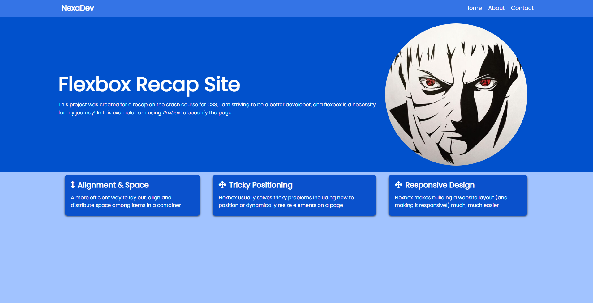

# flexbox-recap
In this repo, I continue my adventure on my 6-month frontend coding roadmap. I take this course from Traversy Media to sharpen my CSS skills.
And its been a successful one as you can see from this repo

* I learnt how to use flexboxes
* Modifying classes with CSS to get required display for your site
* Rows and Columns modification as well

